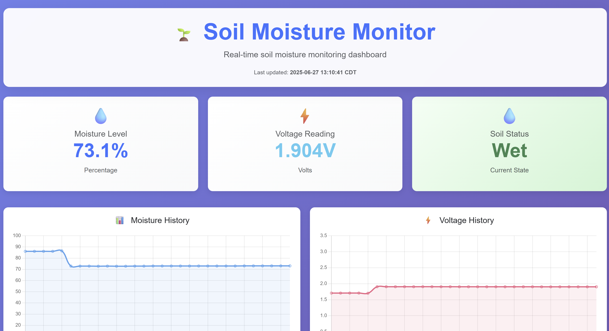

# Soil Moisture Monitor Flask Application

A web application for monitoring soil moisture using an ADS1115 ADC and capacitive soil moisture sensor. Features a responsive dashboard for real-time monitoring.



## Features

- Real-time soil moisture monitoring with hourly data collection
- Responsive web dashboard with live charts
- Time zone support
- Performance optimized for long-term monitoring
- REST API endpoints for data integration
- Simulation mode for testing without hardware

## Use Cases

- Household plant monitoring
- Farm field moisture tracking
- Research data collection

## Hardware Requirements

- Raspberry Pi 4 (or compatible single-board computer)
- ADS1115 16-bit ADC
- Capacitive soil moisture sensor

### Sensor Specifications
- Voltage range: 1.5V (wet) to 3.0V (dry)
- 3.3V-5V compatible
- Corrosion-resistant capacitive design

## Installation

1. Install Python dependencies:
   ```bash
   pip install -r requirements.txt
   ```

2. Hardware connections:
   ```
   ADS1115          Raspberry Pi 4
   --------         --------------
   VDD       →      3.3V (Pin 1)
   GND       →      Ground (Pin 6)
   SCL       →      GPIO 3/SCL (Pin 5)
   SDA       →      GPIO 2/SDA (Pin 3)
   A0        →      Soil sensor signal wire
   ```

3. Enable I2C:
   ```bash
   sudo raspi-config
   # Navigate to Interfacing Options > I2C > Enable
   sudo reboot
   ```

4. Verify connection:
   ```bash
   sudo i2cdetect -y 1
   # ADS1115 should appear at address 0x48
   ```

## Usage

1. Run the application:
   ```bash
   python app.py
   ```

2. Access the dashboard:
   - Local: http://localhost:5000
   - Network: http://[raspberry-pi-ip]:5000

## Performance & Timing

- Sensor readings: Every 1 hour
- Dashboard refresh: Every 15 seconds
- Data history: 30 readings (30 hours)
- Timezone: Central Time (US/Central)

## API Endpoints

- `GET /` - Main dashboard page
- `GET /api/sensor-data` - Current sensor data (JSON)
- `GET /api/history` - Sensor reading history (JSON)

### Example API Response:
```json
{
  "voltage": 2.456,
  "moisture_percentage": 36.3,
  "status": "Moist",
  "last_updated": "2025-06-27 14:30:00 CDT"
}
```

## Configuration

### Sensor Calibration

Adjust calibration values in `app.py`:

```python
def voltage_to_moisture(voltage):
    dry_voltage = 3.0   # Voltage in dry soil
    wet_voltage = 1.5   # Voltage in wet soil
```

### Status Thresholds

Modify moisture thresholds:

```python
def get_moisture_status(percentage):
    if percentage < 25:      # Dry
        return "Dry"
    elif percentage < 65:    # Moist
        return "Moist"
    else:                    # Wet
        return "Wet"
```

## Dashboard Features

- Live moisture percentage, voltage readings, and soil status
- Interactive charts showing 30 hours of data history
- Recent readings table with timestamps
- Color-coded status indicators: Dry (red), Moist (orange), Wet (green)
- Responsive design for desktop and mobile access

## Troubleshooting

### Sensor Not Found
Application runs in simulation mode with random data if ADS1115 is not detected.

### I2C Issues
- Check wiring connections
- Enable I2C: `sudo raspi-config`
- Test connection: `sudo i2cdetect -y 1`
- Verify ADS1115 appears at address 0x48

### Permissions
- Add user to i2c group: `sudo usermod -a -G i2c $USER`
- Reboot after adding to group

### Performance
Hourly readings are optimal for soil moisture monitoring as soil conditions change slowly.
